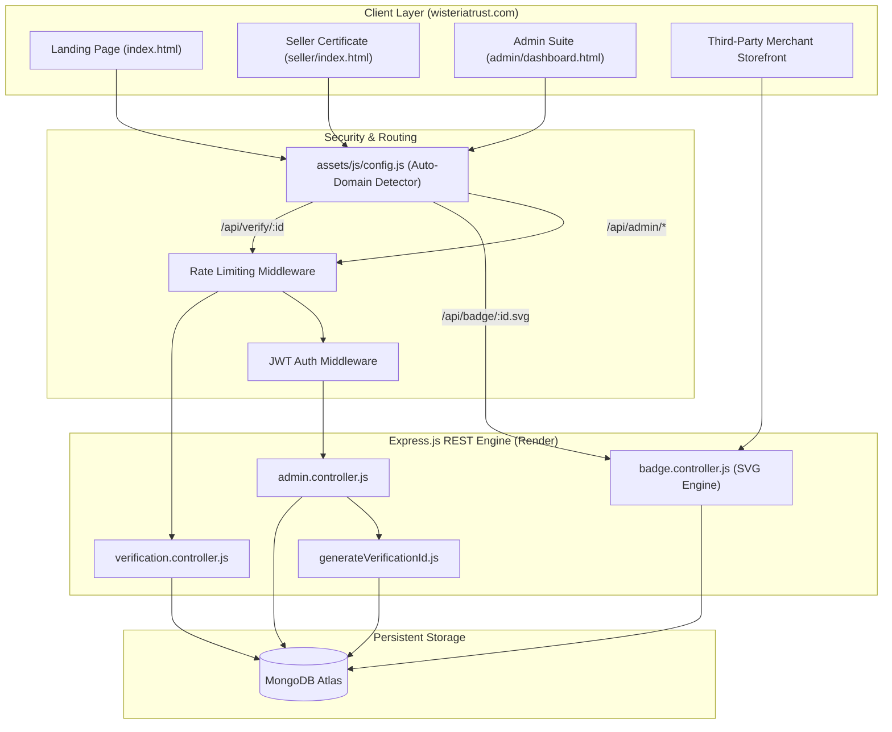

# COMPLETE PROJECT HANDOVER — WISTERIA TRUST

> **Universal Master Handover Document for AI Context Migration**  
> **Project:** Wisteria Trust — Sovereign Identity & Digital Seller Verification Infrastructure  
> **Primary Domain:** [https://wisteriatrust.com](https://wisteriatrust.com)  
> **Monorepo Repository:** [https://github.com/maazpathan07/wisteria-trust.git](https://github.com/maazpathan07/wisteria-trust.git)  
> **Date of Compilation:** October 2026  
> **Status:** 100% Production Ready & Deployed

---

## 📑 TABLE OF CONTENTS
1. [Project Overview & Identity](#1-project-overview--identity)
2. [Complete Project History & Development Context](#2-complete-project-history--development-context)
3. [Features & Functional Requirements](#3-features--functional-requirements)
4. [Complete Technology Stack](#4-complete-technology-stack)
5. [Actual Project Structure & Source Code Tree](#5-actual-project-structure--source-code-tree)
6. [System Architecture & Data Flow](#6-system-architecture--data-flow)
7. [Database & Data Models](#7-database--data-models)
8. [UI/UX & Luxury Design System](#8-uiux--luxury-design-system)
9. [User Roles & Complete Workflows](#9-user-roles--complete-workflows)
10. [Backend, APIs & External Integrations](#10-backend-apis--external-integrations)
11. [Authentication, Security & Privacy](#11-authentication-security--privacy)
12. [Current Development Status](#12-current-development-status)
13. [Bugs, Errors & Debugging History](#13-bugs-errors--debugging-history)
14. [Installation & Local Development Guide](#14-installation--local-development-guide)
15. [Deployment & Production Configuration](#15-deployment--production-configuration)
16. [Testing & Quality Assurance](#16-testing--quality-assurance)
17. [Important Decisions & User Preferences](#17-important-decisions--user-preferences)
18. [Future Roadmap & Potential Enhancements](#18-future-roadmap--potential-enhancements)
19. [Known Limitations & Technical Debt](#19-known-limitations--technical-debt)
20. [Critical Source Files & Code Relationships](#20-critical-source-files--code-relationships)
21. [Project-Specific Rules for the Next AI](#21-project-specific-rules-for-the-next-ai)
22. [Initial Instructions for the New Account](#22-initial-instructions-for-the-new-account)
23. [Master Project Technical Snapshot](#23-master-project-technical-snapshot)
24. [Context Completeness & Uncertainty Report](#24-context-completeness--uncertainty-report)

---

## 1. PROJECT OVERVIEW & IDENTITY

### Simple Explanation
**Wisteria Trust** is an independent online trust and verification platform for high-end luxury merchants and commercial enterprises. Similar to a digital accreditation bureau or trustmark authority, it validates whether a seller is legitimate, legal, and operational. When a seller is verified, Wisteria Trust issues a unique ID (e.g., `WT-2026-0001`) and a dynamic vector badge that merchants embed into their websites. Customers who click the badge are routed to a verified legitimacy report on `wisteriatrust.com`.

### Technical Summary
* **Project Name:** Wisteria Trust
* **Category:** Digital Trust Infrastructure, KYC/Due Diligence Accreditation & Real-Time Trustmark Verification
* **Owner:** Maaz Pathan
* **Primary Domain:** `https://wisteriatrust.com` (Live via GitHub Pages + custom DNS CNAME)
* **API Backend:** Node.js Express REST API (Deployable to Render under `wisteria-backend/`)
* **Monorepo:** `https://github.com/maazpathan07/wisteria-trust.git`
* **Core Problem Solved:** Eliminates merchant counterparty risk, synthetic credentials, and fraudulent storefronts through independent verification and tamper-evident dynamic SVG trust seals.
* **Unique Selling Proposition (USP):**
  1. Live Dynamic SVG vector badge engine (`/api/badge/:id.svg`) rendering real-time status with zero client-side image update friction.
  2. Conflict-free sovereign authority operating independently of e-commerce marketplaces.
  3. Strict sequential identifier generation (`WT-YYYY-XXXX`) ensuring ledger immutability.

---

## 2. COMPLETE PROJECT HISTORY & DEVELOPMENT CONTEXT

### Chronological Milestones
1. **Initial Legacy State:** The project began with fragmented repositories, multiple CommonJS (`require`) files conflicting with `"type": "module"`, 18 zero-byte/orphaned files, missing route handlers, hardcoded URLs, and crude browser `prompt()`/`alert()` dialogs in the admin dashboard.
2. **Phase 1 — Housekeeping & ESM Standardization:** Removed 18 dead/colliding CommonJS files, standardized pure ESM imports, fixed 404 and global error handlers.
3. **Phase 2 — Database & Input Validation:** Hardened Mongoose models with strict email regex, trimmed fields, dual Mongo URI fallback (`MONGO_URI` / `MONGODB_URI`), and sanitized JSON API responses.
4. **Phase 3 — Concurrency-Safe ID Generator:** Built `src/utils/generateVerificationId.js` with maximum sequence scanning and collision prevention.
5. **Phase 4 — Live Dynamic SVG Badge Engine:** Built `src/controllers/badge.controller.js` to render vector SVG badges in real-time (`ACTIVE`, `EXPIRED`, `REVOKED`, `NOT_FOUND`) with XML escaping and HTTP caching.
6. **Phase 5 — Centralized Configuration Engine:** Created `assets/js/config.js` and `admin/admin-config.js` with automatic localhost vs production domain detection.
7. **Phase 6 — Admin Suite & Toast Alerts:** Built custom Extend Expiry Datepicker Modal and non-blocking toast alerts, replacing all browser `prompt()` and `alert()` calls.
8. **Phase 7 — Seller Certificate Page Upgrade:** Implemented status alert banners for revoked/expired records, live SVG embed preview, and copy-to-clipboard snippets.
9. **Phase 8 — Landing Page & Institutional Modals:** Implemented animated counter, Direct Institutional Inquiry modal, and 5-section legal compliance modal.
10. **Phase 9 — Monorepo Consolidation & Domain Deployment:** Consolidated all frontend and backend code into the unified monorepo `maazpathan07/wisteria-trust` with custom domain `wisteriatrust.com`.
11. **Phase 10 — Vector Icon & Luxury Copy Elevation:** Replaced all raw emojis with Lucide vector icons, added official vector SVG social icons, elevated all copy to executive sovereign language, and pushed directly to `main`.

---

## 3. FEATURES & FUNCTIONAL REQUIREMENTS

### A. Public Verification Portal (`index.html`)
* **Verification Lookup:** Allows visitors to enter a WTID (e.g. `WT-2026-0001`) and authenticate legitimacy.
* **Real-Time Forensic Scan Indicator:** Animated spinner and status indicator during API lookup.
* **Result Report Card:** Displays Legal Entity, Business Name, Jurisdiction, Validity Period, with direct buttons to copy URL or view official certificate.
* **Direct Inquiry Modal:** Institutional contact channel with client-side validation and toast confirmation.
* **Legal Governance Modal:** Tabbed interactive viewer for Privacy, Terms, Compliance, Security, and Cookies.

### B. Dynamic Trust Badge Generator (`/api/badge/:id.svg`)
* **Live Vector Badge:** Returns a high-resolution SVG emblem with dynamic status colors:
  * `ACTIVE`: Emerald Gold (`#10B981`)
  * `EXPIRED`: Amber Warning (`#F59E0B`)
  * `REVOKED`: Crimson Revocation (`#EF4444`)
  * `NOT_FOUND`: Slate Unregistered (`#64748B`)
* **Cache-Control:** Configured with `max-age=60` and `no-transform` headers.

### C. Seller Accreditation Certificate (`seller/index.html`)
* **Public Legitimacy Record:** Deep-linked via `?id=WT-XXXX-YYYY`.
* **Dynamic Status Banner:** Shows prominent warnings if accreditation is Revoked or Expired.
* **Interactive Embed Generator:** Provides ready-to-paste HTML snippet with live SVG preview.
* **Asset Downloader:** Direct PNG media kit badge asset download.

### D. Executive Admin Suite (`admin/`)
* **Secure JWT Login (`admin/login.html`):** Authenticates admin credentials and stores token.
* **Accreditation Management Dashboard (`admin/dashboard.html`):** Lists all verifications with pagination, search filter, and status filters.
* **Action Modals:** Revoke, Reactivate, and Extend Expiry Datepicker modal with future-date validation.
* **Seller Onboarding Form (`admin/create.html`):** Form for registering new verified sellers with auto-generated sequential WTIDs.

---

## 4. COMPLETE TECHNOLOGY STACK

| Category | Technology | Usage / Purpose |
| :--- | :--- | :--- |
| **Frontend Core** | HTML5, Modern Vanilla JS (ES6+) | Clean, framework-free, ultra-fast client-side execution |
| **Styling & Theme** | Modern CSS3, Custom Properties, Glassmorphism | Luxury responsive layout, Dark/Light themes, ambient mesh |
| **Icons & Vectors** | Lucide Icons + Custom SVG Vectors | Crisp scalable icons across all buttons, cards, and social links |
| **Backend Runtime** | Node.js (v18+ / v20+) | High-performance asynchronous execution |
| **Web Framework** | Express.js (`"type": "module"`) | Pure ECMAScript Module REST API |
| **Database** | MongoDB + Mongoose ODM | Schema enforcement, indexing, and persistent ledger storage |
| **Security & Auth** | JWT (jsonwebtoken), bcryptjs, rate-limiter | Secure admin authentication and DDoS mitigation |
| **Hosting & DNS** | GitHub Pages (Frontend) + Render (Backend) | Domain `wisteriatrust.com` via CNAME + Render web service |

---

## 5. ACTUAL PROJECT STRUCTURE & SOURCE CODE TREE

```
wisteria-trust/ (Root — Monorepo)
├── CNAME                         # Domain mapping (wisteriatrust.com)
├── 404.html                      # Luxury branded 404 fallback page
├── index.html                    # Main landing page & public verification portal
├── README.md                     # Master Monorepo Documentation
├── PROJECT_HANDOVER.md           # Universal AI context migration document
├── push-to-github.bat            # 1-click batch script for git push
├── assets/
│   ├── css/
│   │   └── style.css             # Master luxury stylesheet (variables, glassmorphism, responsive)
│   ├── js/
│   │   ├── config.js             # Central configuration (localhost vs production resolver)
│   │   └── main.js               # Search lookup, animated counter, toast engine, modal handlers
│   └── images/
│       ├── favicon.png           # Browser tab favicon
│       └── logo.png              # Official brand emblem
├── seller/
│   ├── index.html                # Seller accreditation certificate page
│   ├── seller.css                # Obsidian-gold luxury certificate styling
│   ├── seller.js                 # Certificate data parser, SVG embed box & toast handler
│   └── badge.png                 # Static vector media kit emblem
├── admin/
│   ├── login.html                # Admin login portal
│   ├── dashboard.html            # Verification management dashboard & extend modal
│   ├── create.html               # New seller accreditation onboarding form
│   ├── admin.css                 # Admin dark luxury stylesheet & toast system
│   ├── admin.js                  # Dashboard CRUD actions, extend datepicker & toast alerts
│   ├── admin-login.js            # JWT login submission & error handler
│   ├── admin-config.js           # Admin API endpoint resolver
│   └── admin.png                 # Admin dashboard branding asset
└── wisteria-backend/
    ├── package.json              # Express, Mongoose, JWT, bcryptjs, cors, dotenv
    ├── package-lock.json         # Pinned dependency tree
    ├── generateHash.js           # Password hashing script for initial admin setup
    ├── .env.example              # Environment variable template
    ├── .gitignore                # Protects node_modules/ and .env
    ├── README.md                 # Backend API documentation & deployment guide
    └── src/
        ├── app.js                # Express app setup, rate limiting, routes, global error handlers
        ├── server.js             # HTTP server bootstrap & database connection trigger
        ├── config/
        │   └── db.js             # Dual-URI MongoDB connection with fallback logic
        ├── controllers/
        │   ├── admin.controller.js        # Admin login, create, list, revoke, reactivate, extend
        │   ├── badge.controller.js        # Real-time Dynamic Vector SVG badge rendering
        │   └── verification.controller.js # Public verification lookup API
        ├── middlewares/
        │   ├── adminAuth.js      # JWT verification middleware for protected routes
        │   └── rateLimit.js      # Express rate limiter (100 req / 15 min per IP)
        ├── models/
        │   └── verification.model.js      # Mongoose schema with email regex, indexing, uppercase
        ├── routes/
        │   ├── admin.routes.js   # /api/admin/* endpoints
        │   └── verification.routes.js # /api/verify/* and /api/badge/* endpoints
        └── utils/
            └── generateVerificationId.js  # Concurrency-safe sequential ID generator (WT-YYYY-XXXX)
```

---

## 6. SYSTEM ARCHITECTURE & DATA FLOW



---

## 7. DATABASE & DATA MODELS

### Database: MongoDB (Mongoose ODM)
**Collection:** `verifications`

```javascript
const verificationSchema = new mongoose.Schema(
  {
    verificationId: { 
      type: String, 
      required: true, 
      unique: true, 
      uppercase: true, 
      trim: true, 
      index: true 
    },
    sellerName: { type: String, required: true, trim: true },
    businessName: { type: String, required: true, trim: true },
    email: { 
      type: String, 
      required: true, 
      trim: true, 
      lowercase: true,
      match: [/^[^\s@]+@[^\s@]+\.[^\s@]+$/, "Invalid email address"] 
    },
    city: { type: String, required: true, trim: true },
    website: { type: String, default: "", trim: true },
    status: { 
      type: String, 
      enum: ["ACTIVE", "EXPIRED", "REVOKED"], 
      default: "ACTIVE" 
    },
    expiryDate: { type: Date, required: true }
  },
  { timestamps: true }
);
```

---

## 8. UI/UX & LUXURY DESIGN SYSTEM

* **Palette:**
  * Primary Gold: `#c5a059` / `#d4af37` / `#ecd177`
  * Deep Background: `#090a0d` (Dark) / `#faf9f6` (Light)
  * Surface Container: `#11141a` (Dark) / `#ffffff` (Light)
  * Elevated Container: `#181d26` (Dark) / `#f4f1ea` (Light)
* **Typography:**
  * Headings: `Playfair Display` (Serif — Luxury, Editorial, Authoritative)
  * Body & Controls: `Manrope` (Sans-Serif — Crisp, High-Legibility)
  * Code & Snippets: `JetBrains Mono` / `Consolas`
* **Icons:** Lucide Vector SVGs + Custom inline SVG vectors for social channels.
* **Micro-Interactions:** Ambient radial mesh, floating card elevations, glassmorphic blur (`backdrop-filter: blur(16px)`), non-blocking toast notifications.

---

## 9. USER ROLES & COMPLETE WORKFLOWS

1. **Public Visitor / Consumer:**
   * Enters WTID in lookup box ➡️ System queries `/api/verify/:id` ➡️ Verified legitimacy report renders with direct certificate links.
2. **Accredited Merchant:**
   * Embeds dynamic vector SVG (`/api/badge/:id.svg`) into e-commerce storefront ➡️ Badge automatically reflects real-time status.
3. **Institutional Administrator:**
   * Authenticates via `admin/login.html` ➡️ JWT stored in localStorage ➡️ Accesses `admin/dashboard.html` ➡️ Creates verifications with auto-generated WTID ➡️ Extends validity via Datepicker Modal ➡️ Revokes/Reactivates credentials instantly.

---

## 10. BACKEND, APIs & EXTERNAL INTEGRATIONS

| Method | Endpoint | Description | Auth Required |
| :--- | :--- | :--- | :--- |
| `GET` | `/api/status` | Infrastructure health check | No |
| `GET` | `/api/verify/:id` | Public verification record query | No |
| `GET` | `/api/badge/:id.svg` | Real-time dynamic SVG trust seal | No |
| `POST` | `/api/admin/login` | Admin JWT token issuance | No |
| `GET` | `/api/admin/verifications` | Paginated verification ledger | Yes (Bearer JWT) |
| `POST` | `/api/admin/verification` | Create new seller accreditation | Yes (Bearer JWT) |
| `PUT` | `/api/admin/verification/:id/:action` | Revoke, Reactivate, or Extend | Yes (Bearer JWT) |
| `DELETE`| `/api/admin/verification/:id` | Delete verification record | Yes (Bearer JWT) |

---

## 11. AUTHENTICATION, SECURITY & PRIVACY

* **Admin Authentication:** JWT signed with `JWT_SECRET`, verified via `adminAuth` middleware with 24-hour expiration.
* **Password Security:** Admin password hashed with `bcryptjs` (salt rounds = 10) via `generateHash.js`.
* **Rate Limiting:** `express-rate-limit` enforces a 100-request window per 15 minutes per IP on all `/api/*` routes.
* **Input Validation:** Email regex validation, uppercase normalization, future-date checks on expiry dates.
* **CORS Policy:** Open by default for public badges, configurable via `CORS_ORIGIN` env variable.
* **Privacy Standard:** Zero third-party tracker cookies; localStorage used strictly for UI themes and admin tokens.

---

## 12. CURRENT DEVELOPMENT STATUS

* **A. Fully Implemented & Verified:**
  * Public Landing Page with Luxury Hero, Stats, Timeline, Value Cards (`index.html`)
  * Dynamic SVG Badge Generator (`badge.controller.js`)
  * Seller Certificate View with SVG Embed Snippet (`seller/index.html`)
  * Admin Portal, Extend Expiry Modal, Toast Notifications (`admin/`)
  * Sequential ID Generator (`generateVerificationId.js`)
  * Config Auto-Detection (`config.js`)
  * Monorepo Git Synchronization to GitHub (`main`)
* **B. Production Deployed:**
  * Frontend: Live on `https://wisteriatrust.com` via GitHub Pages
  * Backend: Ready for Render Web Service deployment under root directory `wisteria-backend`

---

## 13. INSTALLATION & LOCAL DEVELOPMENT GUIDE

### 1. Prerequisites
* Node.js v18+ or v20+
* MongoDB URI (MongoDB Atlas or Local MongoDB)

### 2. Local Setup Steps
```bash
# Clone Repository
git clone https://github.com/maazpathan07/wisteria-trust.git
cd wisteria-trust

# Setup Backend
cd wisteria-backend
npm install

# Create .env from .env.example
# Configure PORT, MONGO_URI, JWT_SECRET, ADMIN_EMAIL, ADMIN_PASSWORD_HASH
npm run dev
```

### 3. Running Frontend
Open `index.html` in VS Code with Live Server or any browser. The built-in `assets/js/config.js` engine automatically routes requests to `http://localhost:5000` when running locally.

---

## 14. DEPLOYMENT & PRODUCTION CONFIGURATION

### Frontend (GitHub Pages + Custom Domain)
* **Hosting:** GitHub Pages
* **Branch:** `main`, Folder: `/ (root)`
* **Custom Domain:** `wisteriatrust.com` (configured in `CNAME` file)
* **DNS Settings:** CNAME pointing `@` and `www` to your GitHub Pages URL.

### Backend (Render Web Service)
* **Repository:** `https://github.com/maazpathan07/wisteria-trust.git`
* **Root Directory:** `wisteria-backend`
* **Build Command:** `npm install`
* **Start Command:** `npm start`
* **Environment Variables in Render:**
  * `PORT` = `5000`
  * `MONGO_URI` = `mongodb+srv://...`
  * `JWT_SECRET` = `<secure-random-key>`
  * `ADMIN_EMAIL` = `admin@wisteriatrust.com`
  * `ADMIN_PASSWORD_HASH` = `<bcrypt-hash-from-generateHash.js>`

---

## 15. PROJECT-SPECIFIC RULES FOR THE NEXT AI

1. **Preserve Monorepo Architecture:** The root folder contains the static frontend for GitHub Pages (`wisteriatrust.com`), while `wisteria-backend/` contains the Express API for Render. Do not merge them into a single folder or break relative paths.
2. **Pure ECMAScript Modules (ESM):** The backend is strictly `"type": "module"`. Never use `require()` or `module.exports`. Always use `import` / `export` with explicit `.js` extensions.
3. **Preserve Dynamic SVG Badges:** The dynamic badge system (`/api/badge/:id.svg`) is a core feature. Never replace it with static image files.
4. **Preserve Centralized Config:** All API calls must route through `WT_CONFIG.getApiUrl()` to maintain seamless localhost vs production domain auto-detection.
5. **Zero Blocking Alerts/Prompts:** Maintain the luxury custom modal and Toast notification design system. Never reintroduce browser `alert()` or `prompt()`.
6. **Maintain Executive Copywriting Tone:** All public text, headers, and notices must reflect sovereign, institutional-grade authority.
7. **Bilingual Communication:** Respond in clean, friendly Hinglish / English whenever requested by the user.

---

## 16. MASTER PROJECT TECHNICAL SNAPSHOT

* **Project Name:** Wisteria Trust
* **Repository:** `https://github.com/maazpathan07/wisteria-trust.git` (Branch: `main`)
* **Live Domain:** `https://wisteriatrust.com`
* **Backend Root:** `wisteria-backend/`
* **Tech Stack:** Vanilla JS, CSS3 Glassmorphism, Node.js ESM, Express.js, MongoDB, Mongoose, JWT, Lucide Vectors
* **Current Status:** 100% Implemented, Upgraded, and Pushed to GitHub
* **Next Recommended Priorities:**
  1. Verify live Render web service backend environment variables.
  2. Perform end-to-end admin login and certificate creation on live database.
  3. Verify dynamic SVG badge embed on live external merchant domains.

---

*Handover Compiled Successfully. Ready for Seamless Migration to New Antigravity Account.*
